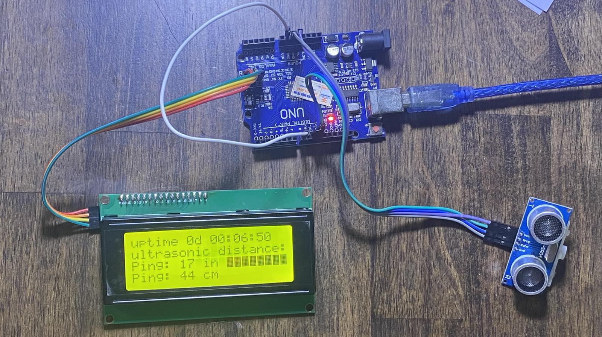

# arduino


Vault for the Arduino projects at Marie Curie. There are more examples in the examples folder, and the 320x240 LCD folder.

## Ultrasonic distance sensor

Using an ultrasonic distance sensor like the [HC-SR04](https://projecthub.arduino.cc/Isaac100/getting-started-with-the-hc-sr04-ultrasonic-sensor-7cabe1) and a 2004 display you can show the distance to sound reflecting objects 3.5 meters away. This project was originally compiled for AISVN on 2019-10-28. It still works 2026 out of the box:



Here is [the code](https://github.com/marie-curie-stem/arduino/blob/main/examples/ultrasonic_lcd2004_en/ultrasonic_lcd2004_en.ino)

``` c
// 2019-10-25 https://github.com/kreier/407B/blob/master/ultrasonic/ultrasonic_lcd2004_en.ino
// 2026-10-05 https://github.com/marie-curie-stem/arduino/tree/main/examples/ultrasonic_lcd2004_en

#include <Wire.h>
#include <hd44780.h>
#include <hd44780ioClass/hd44780_I2Cexp.h> // include i/o class header
#include <NewPing.h>

#define  TRIGGER_PIN   11
#define  ECHO_PIN      10
#define  MAX_DISTANCE 350 // Maximum distance we want to ping for (in centimeters).
                          // Maximum sensor distance is rated at 400-500cm.
#define  PROXIMITY      8 // IR proximity sensor is connected to this pin
#define  LED           13

int DistanceIn;
int DistanceCm;

unsigned long time; // runs over after 4294967295 milliseconds or 49days 17:02:47.295
unsigned long runtime; // seconds this system actually runs
int rollover = 0;
int days    = 0;
int hours   = 0;
int minutes = 0;
int seconds = 0;
char block = 255;
uint32_t counter = 0;

NewPing sonar(TRIGGER_PIN, ECHO_PIN, MAX_DISTANCE);

hd44780_I2Cexp lcd; // declare lcd object: auto locate & config display for hd44780 chip

void setup()
{
  Serial.begin(115200);  // start serial to PC
  Serial.println("Ultrasonic Distance Measurement");  
  pinMode(LED, OUTPUT); // for status LED
  pinMode(PROXIMITY, INPUT);
  time = millis();
  
  // initialize LCD with number of columns and rows:
  lcd.begin(20, 4);

  // Print a message to the LCD
  lcd.setCursor(0,0);  
  lcd.print("uptime 00d 00:00:00 ");
  lcd.setCursor(0,1); 
  lcd.print("ultrasonic distance:");
}

void uptime() {
  if( millis() - time < 0 ) { // rollover happened after unsigned long 4294967295 milliseconds = 49.71 days
    time = millis();
    rollover++;
  }
  runtime = 4294967*rollover + time/1000;
  //lcd.setCursor(0,1);
  //lcd.print(runtime);
  //lcd.print("  ");
  days = runtime / 86400;
  hours = (runtime - days*86400) / 3600;
  minutes = (runtime - days*86400 - hours*3600) / 60;
  seconds = (runtime - days*86400 - hours*3600 - minutes*60);
  lcd.setCursor(0, 0);
  lcd.print("uptime ");
  lcd.print(days);
  lcd.print("d ");
  print2dig(hours);
  lcd.print(":");
  print2dig(minutes);
  lcd.print(":");
  print2dig(seconds);
  lcd.print(" ");
  time = millis();
}

void distance() {
   DistanceIn = sonar.ping_in();
   lcd.setCursor(0,2); 
   lcd.print("Ping: ");
   lcd.print(DistanceIn);  // converts ping time to distance and writes to serial 
                           // (0 = outside set distance range, no ping echo)
   lcd.print(" in   ");
  
   //delay(100);  waits 100 milliseconds between pings. 29 milliseconds is the shortest delay between 2 pings
   DistanceCm = sonar.ping_cm(); // 10 pings per second
   lcd.setCursor(0,3);
   lcd.print("Ping: ");
   lcd.print(DistanceCm); 
   lcd.print(" cm  ");
   // counter += 1;
   // if ((counter % 2) == 0) Serial.println(DistanceCm); // for less frequent ultrasonic values
   Serial.println(DistanceCm);
}

void print2dig (int number) {
  if (number < 10) {
    lcd.print("0");
  }
  lcd.print( number );
}

void proximity() {
  lcd.setCursor(12,2);
  block = 255;
  if( digitalRead(PROXIMITY) == 1) block = 160;
  for(int z=0 ; z < 8; z++) lcd.write(block);
}

void loop()
{
  distance();
  proximity();
  uptime();
  delay(100);   // waits 100 milliseconds between pings. 29 milliseconds is the shortest delay between 2 pings
}
```

We updated to a output stream of distance centimeter data, so you can use the integrated plotter of the Arduino IDE:


## Ambient pressure with the Bosch BMP180, including temperature and relative height

Using the sensor BMP180 to measure the air pressure over I2C we display it on the 2004 display and also calculate the relative height with the barometric formulae. It looks like this:


Here is the code, now 7 years old:

``` c
#include <Wire.h>
#include <hd44780.h>
#include <hd44780ioClass/hd44780_I2Cexp.h> // include i/o class header
/* First you need to include this library 
 *  Go to Sketch > Include Library > Manage Libraries...
 *  Filter your seach, enter hd44780 and install this library
 *  Connect display to SCL-SCL SDA-SDA and VCC-5V and GND-GND
 */
#include <SFE_BMP180.h>

SFE_BMP180 pressure;
hd44780_I2Cexp lcd; // declare lcd object: auto locate & config display for hd44780 chip

char status;
double T,T1,P,P1,p0,a;
int durchlauf = 0;

void setup()
{
  // initialize LCD with number of columns and rows:
  lcd.begin(20, 4);
  lcd.backlight(); 
  Wire.begin();
  lcd.setCursor(0,0);
  if (pressure.begin())
    lcd.print("BMP180 init success");
  else
  {
    // Oops, something went wrong, this is usually a connection problem,
    lcd.print("BMP180 init fail\n\n");
    while(1); // Pause forever.
  }
  for(int i=0;i<10;i++) {
  do {
    status = pressure.startTemperature();
  } while (status = 0);
  delay(100);
  do {
    status = pressure.getTemperature(T1);
  } while (status = 0);
  do {
    status = pressure.startPressure(3);
  } while (status = 0);
  delay(100);
  do {
    status = pressure.getPressure(P1,T1);
  } while (status = 0);
  p0 = P1;
  lcd.clear();
  lcd.setCursor(0,1);
  lcd.print(" Temp: ");
  lcd.print(T1,4);
  lcd.print(" 'C");
  lcd.setCursor(0,2);
  lcd.print("Druck: ");
  lcd.print(P1,3);
  lcd.print(" hPa  ");
  a = pressure.altitude(P1,p0);
  lcd.setCursor(0,3);
  lcd.print("Hoehe: ");
  lcd.print(a,3);
  lcd.print(" m  ");
  delay(100);
  }
}

void loop()
{
  status = pressure.startTemperature();
  if (status != 0)
  {
    // Wait for the measurement to complete:
    delay(status);

    // Retrieve the completed temperature measurement:
    // Note that the measurement is stored in the variable T.
    // Function returns 1 if successful, 0 if failure.

    status = pressure.getTemperature(T);
    if (status != 0)
    {
      lcd.setCursor(0,0);
      lcd.print("Bosch BMP180 Sensor");
      
      // Start a pressure measurement:
      // The parameter is the oversampling setting, from 0 to 3 (highest res, longest wait).
      // If request is successful, the number of ms to wait is returned.
      // If request is unsuccessful, 0 is returned.

      status = pressure.startPressure(3);
      if (status != 0)
      {
        // Wait for the measurement to complete:
        delay(status);

        // Retrieve the completed pressure measurement:
        // Note that the measurement is stored in the variable P.
        // Note also that the function requires the previous temperature measurement (T).
        // (If temperature is stable, you can do one temperature measurement for a number of pressure measurements.)
        // Function returns 1 if successful, 0 if failure.

        status = pressure.getPressure(P,T);
        if (status != 0)
        {
          // Durchschnitt aus 3 Durchläufen
          T1 = 0.9*T1 + 0.1*T;
          P1 = 0.9*P1 + 0.1*P;
          if (durchlauf > 15)
          {
            durchlauf = 0;
            // Print out the measurement:
            lcd.setCursor(0,1);
            lcd.print(" Temp: ");
            lcd.print(T1,4);
            lcd.print(" 'C  ");
            lcd.setCursor(0,2);
            lcd.print("Druck: ");
            lcd.print(P1,3);
            lcd.print(" hPa  ");
            a = pressure.altitude(P1,p0);
            lcd.setCursor(0,3);
            lcd.print("Hoehe: ");
            lcd.print(a,3);
            lcd.print(" m  ");
          }
          durchlauf++;
        }
        else lcd.print("error retrieving pressure measurement\n");
      }
      else lcd.print("error starting pressure measurement\n");
    }
    else lcd.print("error retrieving temperature measurement\n");
  }
  else lcd.print("error starting temperature measurement\n");

  delay(100);  // Pause for 0.1 seconds.
}
```

Vidar code just entered this repository for a change!
